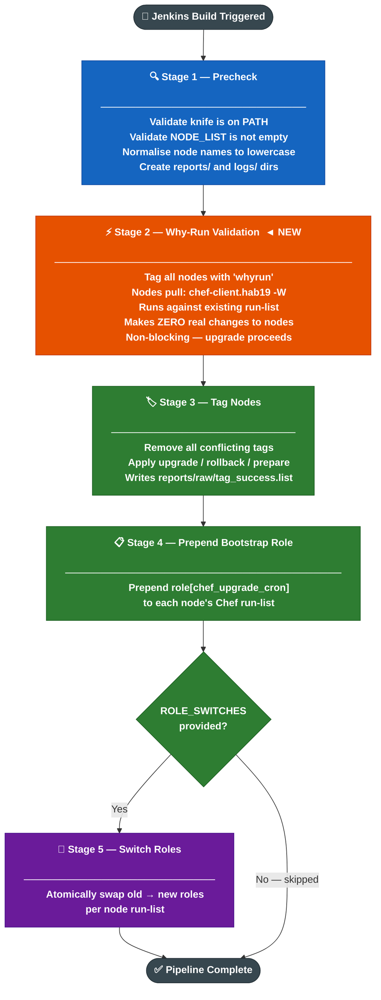
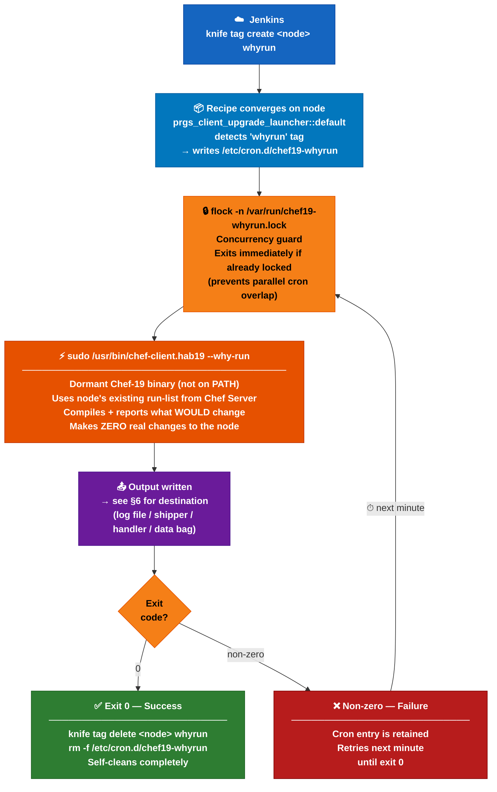
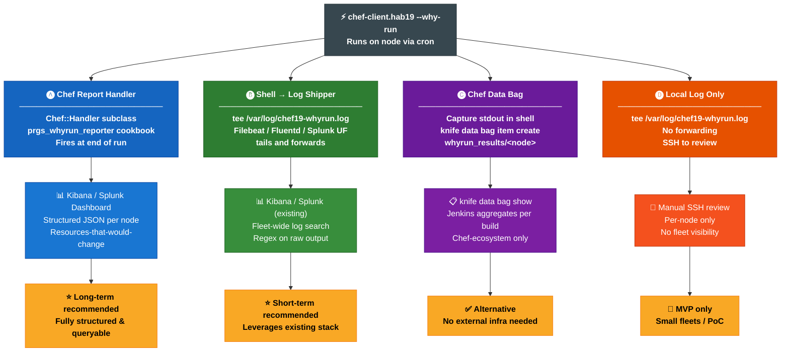
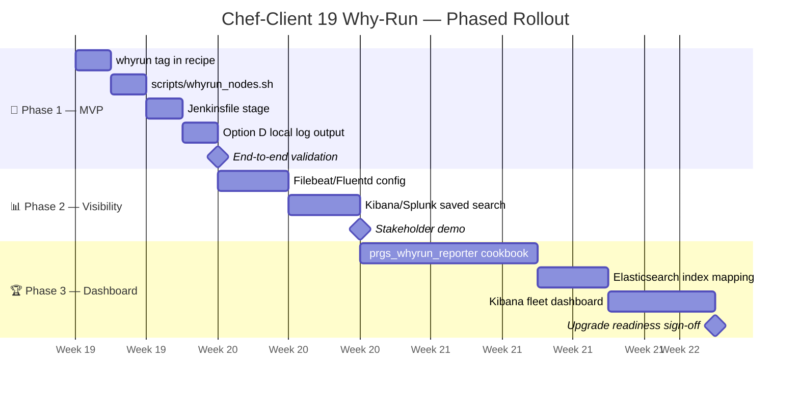

# Chef-Client 19 Why-Run Pipeline — Stakeholder Design

> **Status:** Design Proposal · v1.0 · 14 May 2026
> **Author:** Platform Engineering
> **Branch:** `design/whyrun-pipeline`

---

## 1. Background & Problem Statement

We manage Chef-client upgrades across a large fleet using a tag-based, pull-model Jenkins pipeline.
Nodes currently run **Chef-client 16 as the active version**.
Chef-client 19 is installed in **dormant state** at `/usr/bin/chef-client.hab19` — it is not on `$PATH` and does not run automatically.

**The risk before upgrading:**
There is no way to know what Chef-client 19 would actually change on a node without running it live.
A production upgrade that causes unexpected resource changes (package installs, service restarts, config overwrites) cannot easily be rolled back.

**The goal of this design:**
Provide a safe, non-destructive **why-run (dry-run) pass** using the dormant Chef-client 19 binary against every node's existing run-list, _before_ any upgrade is committed. This gives engineers and stakeholders visibility into the blast radius of the upgrade across the fleet.

---

## 2. What is Why-Run Mode?

`chef-client --why-run` (shorthand `-W`) is Chef's built-in dry-run mode.

- Loads and compiles the full run-list.
- Reports **every resource it would change** — but makes **no actual changes** to the node.
- Exits `0` if the run-list compiles and converges cleanly, non-zero on error.

By invoking `/usr/bin/chef-client.hab19 --why-run`, we test Chef-client 19 against the node's real environment without disturbing the active Chef-client 16 installation.

---

## 3. High-Level Flow



---

## 4. Why-Run Stage — Detailed Flow



**Key design decisions inherited from the upgrade pipeline:**

| Decision | Detail |
|---|---|
| Pull model | Jenkins only tags nodes; nodes initiate their own execution |
| flock guard | Prevents concurrent runs if why-run takes > 1 min |
| `&&` self-removal | Cron removes itself **only** on exit code 0; retries on failure |
| Non-blocking | Why-run exit code does **not** gate the upgrade stages |
| Same binary path | `/usr/bin/chef-client.hab19` — dormant, not on PATH, no side-effects on active client |

---

## 5. Node-Level Components

### 5.1 Chef Recipe — `prgs_client_upgrade_launcher::default`

A new branch in the existing `default.rb` recipe will handle the `whyrun` tag:

```ruby
UPGRADE_TAGS = %w[prepare upgrade rollback whyrun].freeze

# Linux — cron entry for why-run
if node.tags.include?('whyrun')
  file '/etc/cron.d/chef19-whyrun' do
    content "* * * * * root flock -n /var/run/chef19-whyrun.lock " \
            "sudo /usr/bin/chef-client.hab19 --why-run " \
            ">> /var/log/chef19-whyrun.log 2>&1 " \
            "&& knife tag delete $(hostname) whyrun " \
            "&& rm -f /etc/cron.d/chef19-whyrun\n"
    mode    '0644'
    owner   'root'
    group   'root'
    only_if { node.tags.include?('whyrun') }
  end
end
```

### 5.2 Jenkins Pipeline — New Stage

```groovy
stage('Why-Run Validation') {
  steps {
    sh 'TAG_SUCCESS_LIST=reports/raw/tag_success.list bash scripts/whyrun_nodes.sh'
  }
}
```

### 5.3 Shell Script — `scripts/whyrun_nodes.sh`

- Reads `NODE_LIST` (same as all other scripts)
- Tags each node with `whyrun` using `knife tag create`
- Mirrors the parallelism and error handling of `tag_nodes.sh`
- Reports tagged / failed counts to console
- **Does not wait** for why-run execution (nodes run asynchronously via cron)

---

## 6. Output Capture — Four Approaches

> The core challenge: `chef-client --why-run` **does not trigger the Data Collector API**, so Chef Automate / Compliance dashboards will not capture it natively. A custom reporting strategy is required.



---

### Option A — Chef Report Handler → Elasticsearch / Splunk  ⭐ Recommended long-term

```
chef-client.hab19 --why-run
        │
        └─► [Report Handler fires at end of run]
                │
                └─► POST /elasticsearch/_doc/whyrun
                    {
                      "node": "web-prod-01",
                      "chef19_version": "19.x.x",
                      "run_list": ["role[base]", "role[web]"],
                      "would_change": 3,
                      "resources": [
                        { "type": "package", "name": "openssl",
                          "action": "upgrade", "cookbook": "hardening" }
                      ],
                      "elapsed_seconds": 42,
                      "timestamp": "2026-05-14T10:00:00Z"
                    }
```

**How:**
- A lightweight cookbook (`prgs_whyrun_reporter`) registers a `Chef::Handler` subclass.
- The handler collects `run_status.all_resources.select { |r| r.updated? }` — the resources Chef-client 19 **would** change.
- POSTs structured JSON to Elasticsearch (or Splunk HEC).

**Pros:**
- Fully structured and queryable — Kibana dashboard shows "which resources would change on how many nodes"
- Compact payload (resource summary, not raw log)
- Chef report handlers **are** invoked in why-run mode

**Cons:**
- Requires HTTP endpoint reachable from all nodes
- New cookbook to develop and maintain
- Nodes need Elasticsearch/Splunk credentials (secret management required)

**Best for:** Fleets of hundreds of nodes; stakeholder dashboards; repeatable use.

---

### Option B — Shell Wrapper → Local Log File → Existing Log Shipper  ⭐ Recommended short-term

```
chef-client.hab19 --why-run
        │
        └─► /var/log/chef19-whyrun.log   (tee in cron command)
                │
                └─► Filebeat / Fluentd / Splunk UF   (existing agent)
                        │
                        └─► Elasticsearch index: chef19-whyrun-*
                             or Splunk sourcetype: chef:whyrun
```

**How:**
- Cron command pipes output through `tee` to a dedicated log file.
- Add a Filebeat/Fluentd input stanza to tail that file and tag events with `chef19_whyrun: true`.
- Existing log shipper forwards to your current Elasticsearch / Splunk destination.

**Pros:**
- Zero new cookbooks or Ruby code
- Leverages existing observability pipeline and dashboards
- Log file is immediately available on the node for quick SSH inspection

**Cons:**
- Raw log — not structured; searching for "would change" resources requires regex parsing in Kibana/Splunk
- Requires a log shipper already running on every target node
- Log rotation management needed

**Best for:** Teams with Filebeat/Fluentd already deployed; fast to implement.

---

### Option C — Shell Wrapper → Chef Data Bag on Chef Server

```
chef-client.hab19 --why-run → stdout captured in shell variable
        │
        └─► knife data bag item create whyrun_results <node_name>
                │
                └─► Chef Server data bag: whyrun_results/<node>
                        │
                        └─► Jenkins: knife data bag list whyrun_results
                                     (aggregate per build)
```

**How:**
- After the why-run exits, a shell wrapper captures output and uploads a summary data bag item keyed by node name.
- Jenkins can pull results from the Chef server and generate a build report.

**Pros:**
- Stays entirely within the Chef ecosystem — no external infrastructure
- Jenkins can aggregate results centrally using `knife data bag show`

**Cons:**
- Data bags are not designed for large log blobs — structured summary only
- Cron job needs knife credentials on each node (additional secret surface)
- Chef server is not a time-series store; older results are overwritten

**Best for:** Environments with no external observability stack; Chef-only infrastructure.

---

### Option D — Local Log File Only (Simplest MVP)

```
chef-client.hab19 --why-run 2>&1 | tee /var/log/chef19-whyrun.log
```

- Output written to `/var/log/chef19-whyrun.log` (Linux)
- Output written to `C:\chef\logs\chef19-whyrun.log` (Windows)
- No centralisation — engineers review per node via SSH or an existing remote-access tool

**Pros:**
- Trivial to implement (one line change to the cron command)
- No external dependencies

**Cons:**
- No fleet-wide visibility — must check each node individually
- Does not scale beyond a handful of nodes
- No alerting or dashboarding

**Best for:** Proof of concept; small node counts; initial validation before investing in A/B/C.

---

## 7. Approach Comparison Matrix

| Criterion | A — Report Handler + ES/Splunk | B — Log Shipper | C — Data Bag | D — Local Log |
|---|:---:|:---:|:---:|:---:|
| Fleet-wide dashboard | ✅ | ✅ | ⚠️ manual | ❌ |
| Structured / queryable output | ✅ | ⚠️ regex needed | ⚠️ summary only | ❌ |
| External infra required | ✅ ES/Splunk | ✅ shipper agent | ❌ | ❌ |
| New cookbook/code needed | ✅ handler cookbook | ❌ | ⚠️ shell script | ❌ |
| Implementation effort | High | Low | Medium | Minimal |
| Scales to 500+ nodes | ✅ | ✅ | ⚠️ | ❌ |
| Recommended phase | Long-term | Short-term | Alternative | MVP only |

---

## 8. Rollback & Safety Guarantees

- The why-run stage is **always non-blocking** — failure does not halt the upgrade pipeline.
- Chef-client 19 in why-run mode makes **zero changes** to the node (no packages installed, no services restarted, no files modified).
- The dormant binary `/usr/bin/chef-client.hab19` does not affect the active `chef-client` on `$PATH`.
- The `whyrun` tag is self-cleaning — removed by the cron job on success, or manually via `knife tag delete`.
- If the cron fires but Chef-client 19 exits non-zero, the cron entry is retained and retries next minute (same resilience pattern as the upgrade cron).

---

## 9. Windows Equivalent

The same pattern applies on Windows using the Task Scheduler, mirroring the existing upgrade implementation:

```powershell
# Scheduled task action
powershell.exe -NonInteractive -NoProfile -Command "
  & 'C:\opscode\chef19\bin\chef-client.exe' --why-run *>> C:\chef\logs\chef19-whyrun.log;
  if (\$LASTEXITCODE -eq 0) {
    knife tag delete \$env:COMPUTERNAME whyrun
    schtasks /Delete /TN 'chef19-whyrun' /F
  }
"
```

---

## 10. Open Questions for Stakeholders

| # | Question | Owner | Notes |
|---|---|---|---|
| 1 | Is Filebeat / Fluentd / Splunk UF deployed on all target nodes? | Ops | Determines if Option B is viable immediately |
| 2 | Is there an Elasticsearch or Splunk endpoint reachable from nodes? | Ops / Infra | Required for Options A and B |
| 3 | Do nodes have knife credentials available? | Security | Required for Option C and for self-removal of `whyrun` tag |
| 4 | Should why-run ever gate the upgrade? (e.g. if > N resources would change) | Engineering Lead | Currently non-blocking by design |
| 5 | Approximate node count for this rollout? | Ops | Influences which output approach to prioritise |
| 6 | Is there a preference to stay Chef-ecosystem-only vs external tooling? | Architecture | Guides A vs C |

---

## 11. Recommended Phased Approach



| Phase | Deliverable | Option | Effort |
|---|---|---|---|
| 1 — MVP | Local log on node, full pipeline wired up | D | 1–2 days |
| 2 — Visibility | Fleet-wide search via existing log shipper | B | ~1 week |
| 3 — Dashboard | Structured Kibana dashboard, stakeholder sign-off | A | 2–3 weeks |

---

*Document generated from design discussions on 14 May 2026.*
*Next step: stakeholder review → select output approach → Phase 1 implementation.*
